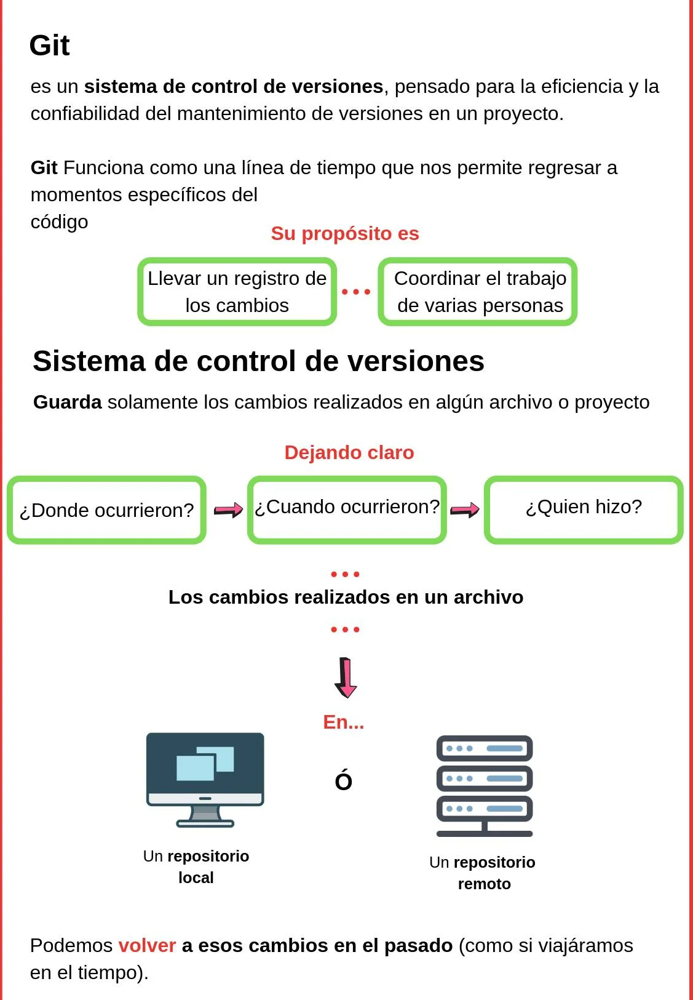
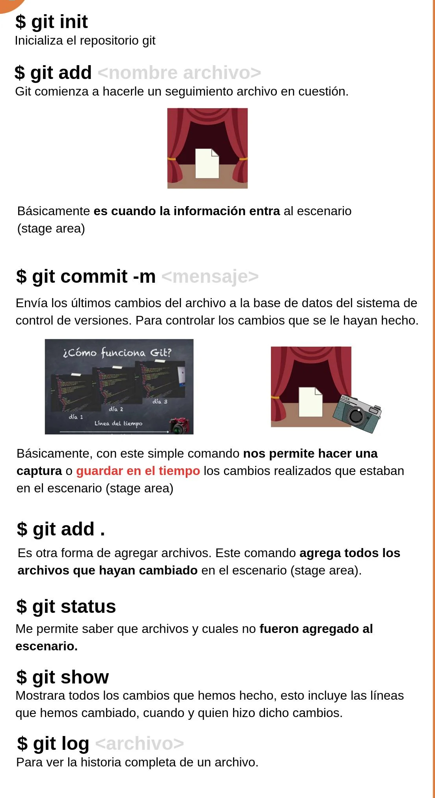
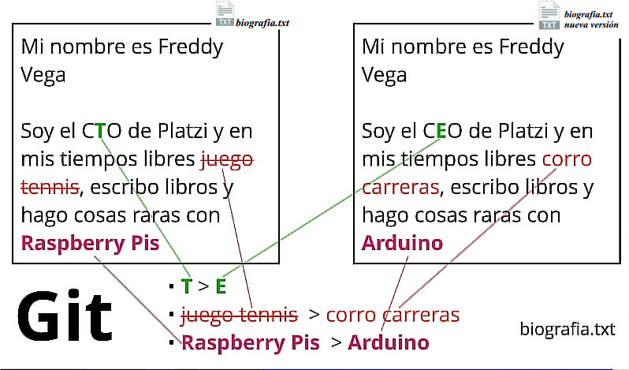

# 1
 ### ***¿Por qué usar un sistema de control de versiones como Git?***

 Un sistema de control de versiones como Git nos ayuda a guardar el historial de cambios y crecimiento de los archivos de nuestro proyecto.

 En realidad, los cambios y diferencias entre las versiones de nuestros proyectos pueden tener similitudes, algunas veces los cambios pueden ser solo una palabra o una parte específica de un archivo específico. Git está optimizado para guardar todos estos cambios de forma atómica e incremental, o sea, aplicando cambios sobre los últimos cambios, estos sobre los cambios anteriores y así hasta el inicio de nuestro proyecto.

 * El comando para iniciar nuestro repositorio, o sea, indicarle a Git que queremos usar su sistema de control de versiones en nuestro proyecto, es `git init`.

 * El comando para que nuestro repositorio sepa de la existencia de un archivo o sus últimos cambios es `git add`. Este comando no almacena las actualizaciones de forma definitiva, únicamente las guarda en algo que conocemos como “Staging Area” (área de montaje o ensayo).

 El comando para almacenar definitivamente todos los cambios que por ahora viven en el staging area es `git commit`. También podemos guardar un mensaje para recordar muy bien qué cambios hicimos en este commit con el argumento `-m "Mensaje del commit"`.
 
 * Por último, si queremos mandar nuestros commits a un servidor remoto, un lugar donde todos podamos conectar nuestros proyectos, usamos el comando `git push`.

 

#### ***Comandos básicos de git***

 * **git init:**  inicializa un repositorio de GIT en la carpeta donde se ejecute el comando.

 * **git add:** añade los archivos especificados al área de preparación (staging).
 
 * **git commit -m “commit description”:** confirma los archivos que se encuentran en el área de preparación y los agrega al repositorio.

 * **git commit -am “commit description”:** añade al staging area y hace un commit mediante un solo comando. (No funciona con archivos nuevos)

 * **git status:** ofrece una descripción del estado de los archivos (untracked, ready to commit, nothing to commit).

 * **git rm (. -r, filename) (–cached):** remueve los archivos del index.

 * **git config --global user.email tu@email.com:** configura un email.

 * **git config --global user.name <Nombre como se verá en los commits>:** configura un nombre.

 * **git config --list:** lista las configuraciones.
 
  
 

#### ***Analizar cambios en los archivos de un proyecto Git***

 * **git log:** lista de manera descendente los commits realizados.

 * **git log --stat:** además de listar los commits, muestra la cantidad de bytes añadidos y eliminados en cada uno de los archivos modificados.

 * **git log --all --graph --decorate --oneline:** muestra de manera comprimida toda la historia del repositorio de manera gráfica y embellecida.
 * **git show filename:** permite ver la historia de los cambios en un archivo.
 * **git diff <commit1> <commit2>:** compara diferencias entre en cambios confirmados.

#### ***Volver en el tiempo con branches y checkout***
 * **git reset <commit> --soft/hard:** regresa al commit especificado, eliminando todos los cambios que se hicieron después de ese commit.
 * **git checkout <commit/branch> <filename>:** permite regresar al estado en el cual se realizó un commit o branch especificado, pero no elimina lo que está en el staging area.
 * **git checkout – <filePath>:** deshacer cambios en un archivo en estado modified (que ni fue agregado a staging)

 ### ***git rm y git reset***
 
 #### ***git rm:*** 
 Este comando nos ayuda a eliminar archivos de Git sin eliminar su historial del sistema de versiones. Esto quiere decir que si necesitamos recuperar el archivo solo debemos “viajar en el tiempo” y recuperar el último commit antes de borrar el archivo en cuestión.
 
 git rm no puede usarse por sí solo, así nomás. Se debe utilizar uno de los flags para indicar a Git cómo eliminar los archivos que ya no se necesitan en la última versión del proyecto:

 * **git rm --cached <archivo/s>:** elimina los archivos del área de Staging y del próximo commit, pero los mantiene en nuestro disco duro.

 * **git rm --force <archivo/s>:** elimina los archivos de Git y del disco duro. Git siempre guarda todo, por lo que podemos acceder al registro de la existencia de los archivos, de modo que podremos recuperarlos si es necesario (pero debemos aplicar comandos más avanzados).
 
 #### ***git reset:***
 Con git reset volvemos al pasado sin la posibilidad de volver al futuro. Borramos la historia y la debemos sobreescribir.

 * **git reset --soft:** Vuelve el branch al estado del commit especificado, manteniendo los archivos en el directorio de trabajo y lo que haya en staging considerando todo como nuevos cambios. Así podemos aplicar las últimas actualizaciones a un nuevo commit.

 * **git reset --hard:** Borra absolutamente todo. Toda la información de los commits y del área de staging se borra del historial.

 * **git reset HEAD:** No borra los archivos ni sus modificaciones, solo los saca del área de staging, de forma que los últimos cambios de estos archivos no se envíen al último commit. Si se cambia de opinión se los puede incluir nuevamente con git add.

 ### ***Ramas o Branches en git***
 Al crear una nueva rama se copia el último commit en esta nueva rama. Todos los cambios hechos en esta rama no se reflejarán en la rama master hasta que hagamos un merge.

 * **git branch <new branch>:** crea una nueva rama.
 * **git checkout <branch name>:** se mueve a la rama especificada.
 * **git merge <branch name>:** fusiona la rama actual con la rama especificada y produce un nuevo commit de esta fusión.
 * **git branch:** lista las ramas generadas.

 #### ***Ejmeplo***

 

 > Para ver con más detalle  el ejemplo vea el siguiente pdf
 >>Link   [PDF](https://acortar.link/BW04WB).

# 2
 ### ***¿Qué es Git?***
 Git es un sistema de control de versiones distribuido, diseñado por Linus Torvalds. Está pensando en la eficiencia y la confiabilidad del mantenimiento de versiones de aplicaciones cuando estas tienen un gran número de archivos de código fuente.

 * Git está optimizado para guardar cambios de forma incremental.

 * Permite contar con un historial, regresar a una versión anterior y agregar funcionalidades.

 * Lleva un registro de los cambios que otras personas realicen en los archivos.

 Git fue diseñado para operar en un entorno Linux. Actualmente, es multiplataforma, es decir, es compatible con Linux, MacOS y Windows. En la máquina local se encuentra Git, se utiliza bajo la terminal o línea de comandos y tiene comandos como merge, pull, add, commit y rebase, entre otros.

 ### ***Características de Git***

 * Git almacena la información como un conjunto de archivos.

 * No existen cambios, corrupción en archivos o cualquier alteración sin que Git lo sepa.

 * Casi todo en Git es local. Es difícil que se necesiten recursos o información externos, basta con los recursos locales con los que cuenta.

 * Git cuenta con 3 estados en los que es posible localizar archivos: Staged, Modified y Committed.

 ### ***Para qué proyectos sirve Git***
 Con Git se obtiene una mayor eficiencia usando archivos de texto plano, ya que con archivos binarios no puede guardar solo los cambios, sino que debe volver a grabar el archivo completo ante cada modificación, por mínima que sea, lo que hace que incremente demasiado el tamaño del repositorio.

 “Guardar archivos binarios en el repositorio de Git no es una buena práctica, únicamente deberían guardarse archivos pequeños (como logos) que no sufran casi modificaciones durante la vida del proyecto. Los binarios deben guardarse en un CDN”.

 ### ***¿Qué es un sistema de control de versiones?***

 El SCV o VCS (por sus siglas en inglés) es un sistema que registra los cambios realizados sobre un archivo o conjunto de archivos a lo largo del tiempo, de modo que puedas llevar el historial del ciclo de vida de un proyecto, comparar cambios a lo largo del tiempo, ver quién los realizó o revertir el proyecto entero a un estado anterior.

 Cualquier tipo de archivo que se encuentre en un ordenador puede ponerse bajo control de versiones.

 

 ### ***¿En qué se diferencia de Github?***

 Github es una plataforma de desarrollo colaborativo para alojar proyectos utilizando el sistema de control de versiones Git. Se emplea principalmente para la creación de código fuente de programas de computadora.

 Puede considerarse a Github como la red social de código para los programadores y en muchos casos es visto como un curriculum vitae, pues aquí se guarda el portafolio de proyectos de programación.

 ### ***Características de Github***

 * GitHub permite alojar proyectos en repositorios de forma gratuita y pública, pero tiene una forma de pago para privados.

 * Puedes compartir fácilmente tus proyectos.

 * Permite colaborar para mejorar los proyectos de otros y a otros mejorar o aportar a los tuyos.

 * Ayuda a reducir significativamente los errores humanos, a tener un mejor mantenimiento de distintos entornos y a detectar fallos de una forma más rápida y eficiente.

 * Es la opción perfecta para poder trabajar en equipo en un mismo proyecto.

 * Ofrece todas las ventajas del sistema de control de versiones Git, pero también tiene otras herramientas que ayudan a tener un mejor control de los proyectos.

 > Video sobre Git & GitHub
 >>Link [Youtube](https://youtu.be/DinilgacaWs).
 